```{r Setup, include = FALSE}
options(htmltools.dir.version = FALSE)
library(knitr)
library(tidyverse)
library(xaringanExtra)
# remotes::install_github('nhs-r-community/NHSRtheme')
# remotes::install_github("https://github.com/nhs-r-community/NHSRdatasets")
library(NHSRtheme)
library(NHSRdatasets)
# remotes::install_github("mitchelloharawild/icons")
library(icons)
# set default options
opts_chunk$set(echo=FALSE,
               collapse = TRUE,
               fig.width = 7.252,
               fig.height = 4,
               dpi = 300)

# set engines
knitr::knit_engines$set("markdown")

xaringanExtra::use_tile_view()
xaringanExtra::use_panelset()
xaringanExtra::use_clipboard()
xaringanExtra::use_webcam()
xaringanExtra::use_broadcast()
xaringanExtra::use_share_again()
xaringanExtra::style_share_again(
  share_buttons = c("twitter", "linkedin", "pocket")
)


# uncomment the following lines if you want to use the NHS-R theme colours by default
# scale_fill_continuous <- partial(scale_fill_nhs, discrete = FALSE)
# scale_fill_discrete <- partial(scale_fill_nhs, discrete = TRUE)
# scale_colour_continuous <- partial(scale_colour_nhs, discrete = FALSE)
# scale_colour_discrete <- partial(scale_colour_nhs, discrete = TRUE)


# Libraries for actaual content
#### Libraries ####
library(openxlsx)
library(forecast)
library(tsibble)
library(dplyr)
library(lubridate)
library(patchwork)
library(ggplot2)
library(zoo)
library(conflicted)


conflict_prefer("filter", "dplyr")
conflict_prefer("select", "dplyr")
conflicts_prefer(zoo::index)
conflicts_prefer(plotly::layout)

source("/Users/danielhintz/Dropbox/UNI/WEST_int/R_files/Helper_Functions.R")
R_data <- "/Users/danielhintz/Dropbox/UNI/WEST_int/data/"

#### Reading in Data ####
level <-
  openxlsx::read.xlsx("/Users/danielhintz/Dropbox/UNI/WEST_int/JacksonLake/DavidThomaFiles/Snake at Flag Ranch Gridmet_Penman_Hamon_Oudin_Batch_v3.1 3 flows 1983-2022.xlsm",
    sheet = "Jackson Lake annual",
    startRow = 1,
    colNames = TRUE,
    rowNames = FALSE,
    detectDates = TRUE,
    cols = c(1:6)
  )

#### Data Rescaling ####
level_ts_d <- ts(level$jck_fb , start=c(1979, 1, 1), frequency=365)
level_ts_y <- ts_Rescale(level_ts_d, "%Y")$ts 
level_ts_m <- ts_Rescale(level_ts_d, "%m")$ts 

#### Splits ####
lv_split_y <- ts_split(level_ts_y, split = "2015-01-01")
lv_split_m <- ts_split(level_ts_m, split = "2015-01-01")
lv_split_d <- ts_split(level_ts_d, split = "2015-01-01")
```


class: title-slide, right, top
background-image: url(img/hex-xaringan.png), url(img/GTLCColterBay-1920x1280.jpg)
background-position: 90% 75%, 75% 75%
background-size: 8%, cover

<!--
```{r}
# background-image: hex-xaringan.png(xaringan logo) background photo
```
-->

.right-column[
# `r rmarkdown::metadata$title`
### `r rmarkdown::metadata$subtitle`

**`r rmarkdown::metadata$author`**<br>
`r rmarkdown::metadata$date`
]

.palegrey[.left[.footnote[Photo by [GrandTetonLodgeCo](https://jacksonhole-traveler-production.s3.amazonaws.com/wp-content/uploads/2014/06/GTLCColterBay-1920x1280.jpg)]]]


---
<div class="logo"></div>

# Outline (1)

- Downstream Variables and Lake level

--

- Motivation for SPI

--

- Limitations for Long-term forecasting 

--

- SNIAVE long-term forecasts

--

- Bayesian Long Term Forecast 

--

- Why am I showing you This?

--

- Assumptions of our Methods used

---

# Outline (2)

- Unexplored LTTF Methods

--

- What is State of the Art for LTTF

--

- Recommendations

--

- Successes and Failures 

--

- References


---
<div class="logo"></div>

# Downstream Variables and Lake level


.panelset[

.panel[.panel-name[Dual Axis Plot]
<div id="htmlwidget_container" class="plotly html-widget" style="position: relative; width: 700px; height: 500px;">
```{r plotly_Dual_Axis_Plot}
load(
  "/Users/danielhintz/Dropbox/UNI/WEST_int/R_files/Dual_axis_plot/Plotly_dual_axis_plot_Outflow_vs_Deficit.RData"
)

Plotly_dual_axis_plot_Outflow_vs_Deficit <-
  plot_ly(data = Outflow_v_Deficit_m,
          width = 800,
          height = 415) %>%
  add_lines(
    x = ~ Date,
    y = ~ Outflow / coeff_1 ,
    name = "Outflow",
    line = list(color = Outflow_Color, width = 2.5)
  ) %>%
  add_lines(
    x = ~ Date,
    y = ~ Deficit / coeff_2,
    yaxis = "y2",
    name = "Deficit",
    line = list(color = Deficit_Color, width = 2)
  ) %>%
  layout(
    title = "Outflow Versus Deficit",
    plot_bgcolor = plot_background,
    yaxis = list(
      title = "Outflow (cbc ft psc)",
      gridcolor = Outflow_grid ,
      gridwidth = grid_thickness,
      tickvals = y1_ticks,
      ticktext = y1_labels
    ),
    yaxis2 = list(
      title = "Deficit (in)",
       titlefont = list(color = Deficit_Color), 
      overlaying = "y",
      side = "right",
      tickvals = y2_ticks,
      ticktext = y2_labels,
      gridcolor = Deficit_grid,
      gridwidth = grid_thickness,
      bgcolor = transparent_white
    ),
    xaxis = list(bgcolor = area_background)
  )
Plotly_dual_axis_plot_Outflow_vs_Deficit 
```
</div>
]

.panel[.panel-name[Postmortem]

> *Because Jackson Lake Dam managers release water from the lake in controlled, consistent increments to prevent significant fluctuations, downstream phenomena unlikely to be predictive of fluctuations in Lake level.*

- Thus, meteorological variables concerning the upper snake river are key (Supply side)


]

.panel[.panel-name[Transition]

- On the next slide we will see Deficit, SPI and Lake level altogether 

]
]

---
background-image: url(img/SPI_vs_LakeLevel_vs_Deficit.PNG)
background-size: contain
background-color: white
class: inverse, middle, center

<div class="logo"></div>

```{r SPI_vs_Lake_Level_vs_Deficit}
# Below show how SPI_vs_LakeLevel_vs_Deficit.PNG was generated, not after generating the pdf I converted it to a PNG

load("/Users/danielhintz/Dropbox/UNI/WEST_int/Jackson_Lake_Final_Pres/Blackfoot_monthly_SPI.Rdata")
level$date <- as.Date(paste0(level$year,"-", level$month, "-",level$day))
level_m <- as_tsibble(level, index = date) %>%
  mutate(year_month = ymd(paste(year(date), month(date), "01"))) %>% 
index_by(year_month) %>%
  summarise(across(-c(date), ~mean(., na.rm = TRUE))) %>%
  rename(date = year_month)
level_87 <- level_m %>% filter(date >= as.Date("1987-07-01") & date <= as.Date("2021-12-01"))
spi_87<- jc_spi_regPET_m_df %>% filter(date >= as.Date("1987-07-01") & date <= as.Date("2021-12-01"))


# par(col.axis = "#302B25", col.lab = "#302B25", col.main = "#302B25", 
#     col.sub = "#302B25", fg = "#302B25", bg = "#FFFEFE", 
#     lwd = 2)
# 
# st <- decimal_date(as.Date("1987-07-01"))
# pdf(file = "SPI_vs_LakeLevel_vs_Deficit.pdf")
# par(mfrow = c(3,1))
# plot(ts(level_87$jck_fb,             start = c(st), frequency = 12), ylab = "Level")
# plot(ts(spi_87$SPI,                  start = c(st), frequency = 12), ylab =  "SPI")
# plot(ts(Outflow_v_Deficit_m$Deficit, start = c(st), frequency = 12), ylab =  "Blackfoot Deficit")
# par(mfrow = c(1,1))
# dev.off()
```

---
<div class="logo"></div>

# Motivation for SPI

.pull-left[

<div style="text-align: center;">
  <h2 style="font-size: 16px;">Wyoming Drought Index</h2>
  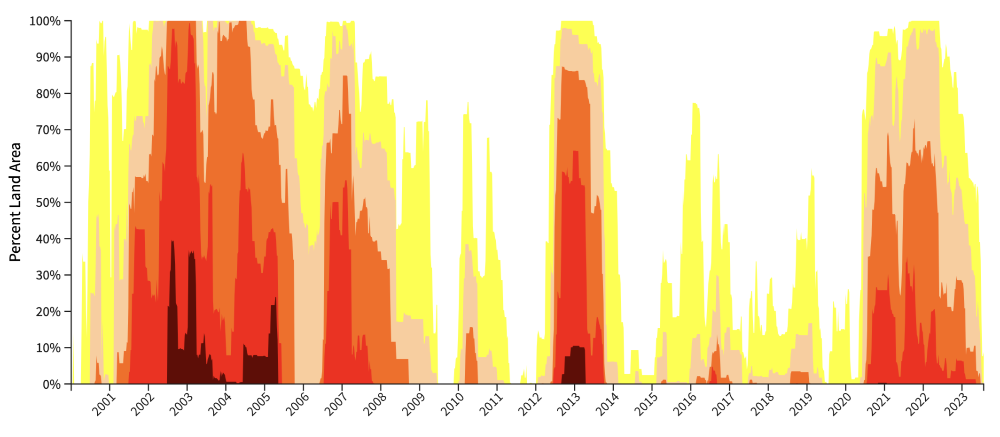
</div>

]
.pull-right[

<div id="htmlwidget_container" class="plotly html-widget" style="position: relative; width: 700px; height: 500px;">
```{r Droght_level_comp}
ts_plotly(list(level_ts_d), ylab = "level (ft)", title = "Jackson Lake level (Daily)",colors = c("#6FB1D1"),plot_height = 540, plot_width = 500) %>%
  add_lines(x = ~Date, y = rep(6753, nrow(as_tsibble(level_ts_d))), line = list(color = 'goldenrod')) 
```
</div>

]
 
---
<div class="logo"></div>

# Limitations for Long-term forecasting 

- Forecasting predictor variables for our overall forecasts 

--

- Generally, the more stationary a process the more predictable it is. (Lake level is not stationary)

--

- Long term forecasts are inherently very noisy 

--

- For common forecasting methods, if there isn't a persistence in the captured trend and seasonality wane with longer forecasting periods, i.e. they become SNAIVE or a flat line (see example on next slide)

--

    - For example ARIMA was built for short-time forecasting 


---
<div class="logo"></div>

# SNAIVE long-term forecasts 

.panelset[

.panel[.panel-name[SNAIVE]

<div style="text-align: center;">
  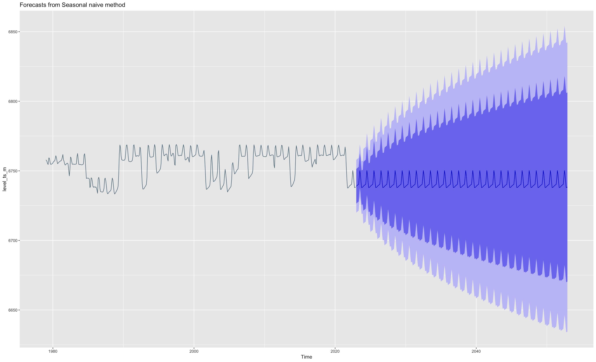
</div>

]

.panel[.panel-name[ARIMA]

<div style="text-align: center;">
  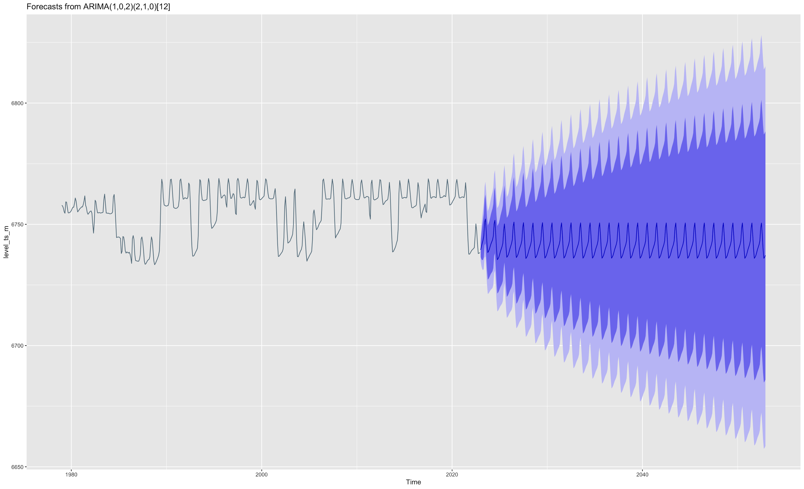
</div>

]


.panel[.panel-name[Sub-Series]

<div style="text-align: center;">
  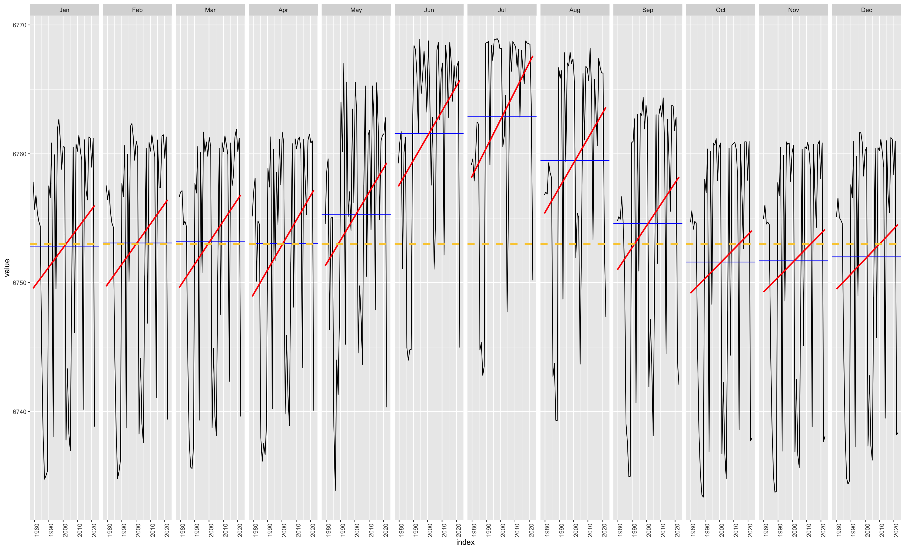
</div>

]

.panel[.panel-name[SNAIVE Sub-Series]

<div style="text-align: center;">
  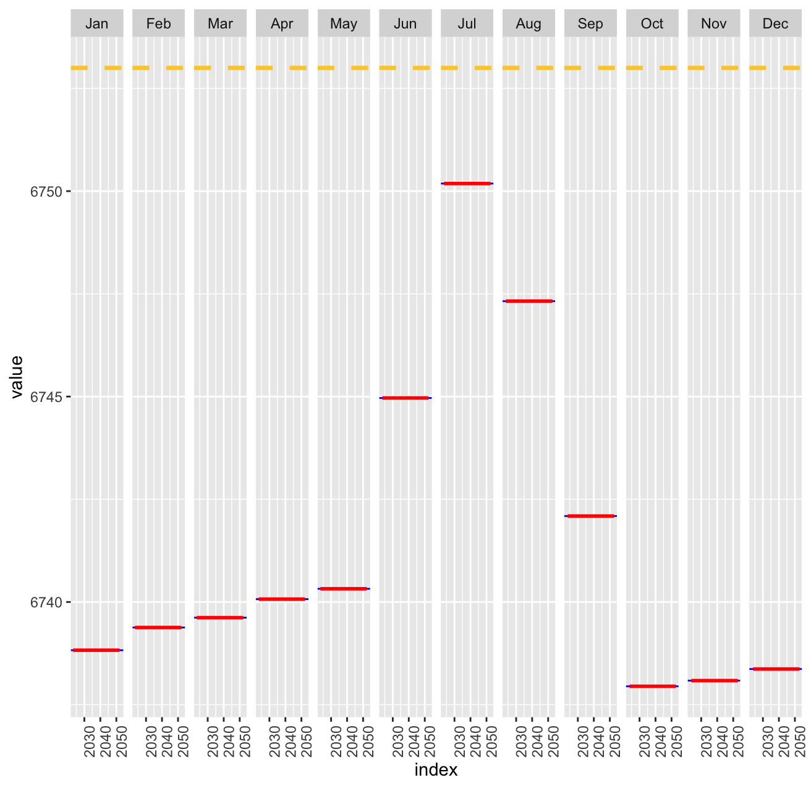
</div>


]

.panel[.panel-name[ARIMA Sub-Series]

<div style="text-align: center;">
  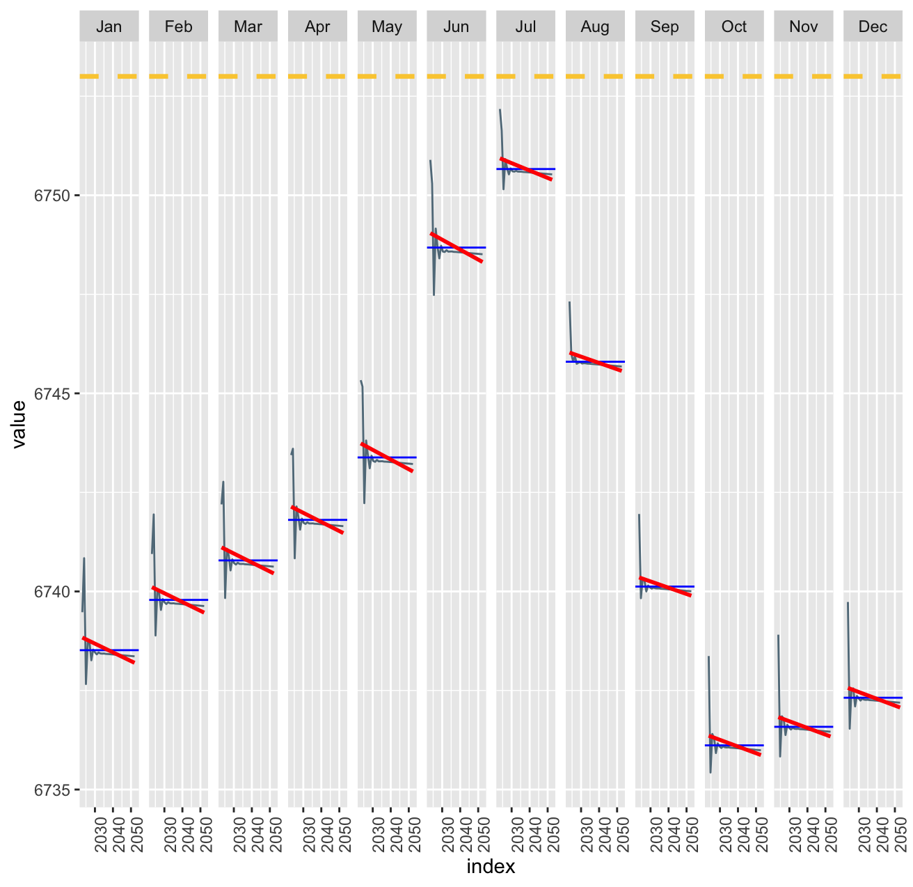
</div>

]
]

<!-- text immediately below ??? is present note accessible from presenter mode from hitting P-->
???
- Why am I showing you forecasts that are clearly bad? 
- Because we need covariates that capture information that allows for drift and non-stationary in our forecasts
- So what might they those covariates/variables be?
- For that we might need your insights 
<!-- there is no symbol to end presenter comments-->


---
<div class="logo"></div>

# Bayesian Long Term Forecast 


.panelset[

.panel[.panel-name[Single Iteration]

<div id="htmlwidget_container" class="plotly html-widget" style="position: relative; width: 700px; height: 500px;">
```{r}
load("/Users/danielhintz/Dropbox/UNI/WEST_int/Jackson_Lake_Final_Pres/allcovResp2.RData")
plot_bsts_prediction_plotly(allcovResp2$pred_list[[1]] ,plot_height = 415, plot_width = 800)

```
</div>

]


.panel[.panel-name[Multiple Iterations]

<div id="htmlwidget_container" class="plotly html-widget" style="position: relative; width: 700px; height: 500px;">
```{r}
ts_plotly(
allcovResp2$pred_list_ts, plot_height = 415, plot_width = 800
)

```
</div>

]

.panel[.panel-name[Bootstrap]

<div id="htmlwidget_container" class="plotly html-widget" style="position: relative; width: 700px; height: 500px;">
```{r}
ts_plotly(
allcovResp2$bagged_average_ts, plot_height = 415, plot_width = 800
)
```
</div>

]

.panel[.panel-name[Discussion]

### Why am I showing you this?

- Bayesian time series allows for information like trend and seasonality to persist

- However, a 30 year forecast window allows for A LOT of uncertainty! 

- So this forecast is not to be trusted! 

]

.panel[.panel-name[Variables]

<div style="text-align: center;">
  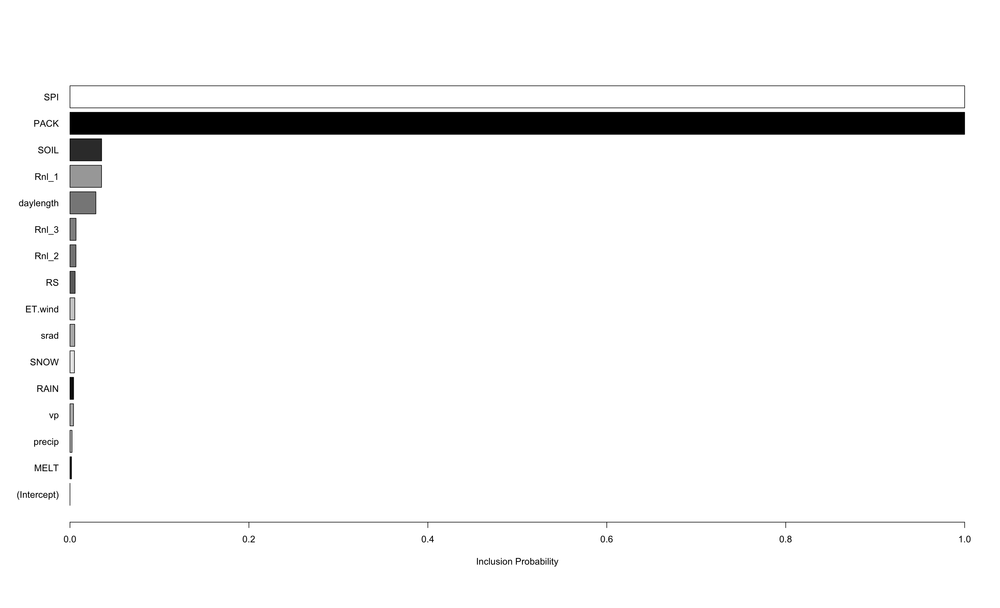
</div>

]


]

---
<div class="logo"></div>

# Assumptions of our Methods used

- Main Assumptions/use-cases are 

--

    - Stationarity 
--
    - Linearity

--

- Classical methods (Autoregressive Moving Average (ARMA) and Auto-regressive Method (AR)) have been shown to perform best on systems with simpler underlying structures 

--

    - Specilised Machine Lerning Methods may be prefered over Classical statisitcs for forecasting meteorological systems 

---
<div class="logo"></div>

# Unexplored LTTF Methods


- Error-Correction Model for Co-integrated Time Series 

--

    - Is intended for matrix of covariates that share long-run relationships with the response
--
    - ECM makes it possible to deal with non- stationary data series 
  
--

- ANFIS (Adaptive neuro fuzzy inference system)

--

    - Tested performance for predicting 1 month ahead Urmia Lake Level in Iran
--
    - Was able to account for drift in observed series  
--
    - No documented uses of long term forecasting, though I wouldn't rule it out  

--

- There are in fact, many types of forecasting methods for Time series surfacing in the literature, open source implementation is still lacking for long-term time-series forecasting (LTTF)

---
<div class="logo"></div>

# What is State of the Art for LTTF

<br>
<br>

<div style="text-align: center;">
    <figure>
        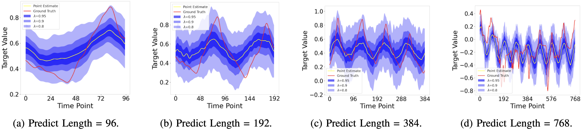
        <figcaption style="text-align: left; font-size: 12px;">See Li, Y., X. Lu, H. Xiong, et al. (2023)</figcaption>
    </figure>
</div>


---
<div class="logo"></div>

# Recommendations 

- Find a supply side variable that better captures shocks 

--

- Try aggregating SPI measures around Upper Snake River Watershed 

--

- Try ANFIS (Adaptive neuro fuzzy inference system), see Talebizadeh, M. and A. Moridnejad (2011) for short term forecast

---
<div class="logo"></div>

# Successes and Failures 

#### Successes:

--

- Identified that downstream phenomena are not effective predictors for lake level

--

- Identified variables of interest for future work (SPI, PACK, SOIL Rnl_1)

--

- Was able to achieve strong back-cast performance for a short term forecasting 

--

#### Failures:

- Was not able to include scenario based climate forecasts ie (rcp's) 

--

- Was not able to predict changing frequency in shocks 

--

- Was not able to generate a forecast of acceptable accuracy

---
<div class="logo"></div>

# References (1)


```{r print_refs_1,results='asis', echo=FALSE, warning=FALSE, message=FALSE}
print_refs <- function(bib_path, keys_to_include, ui = "- ") {
  
  bib <- RefManageR::ReadBib(bib_path, check = FALSE)
  
  # REMEMBER to set the options results='asis', echo=FALSE, warning=FALSE, message=FALSE
  # in {r}
  
  for (i in 1:length(keys_to_include)) {
    writeLines(ui)
    print(bib[key = keys_to_include[i]],
          .opts = list(check.entries = FALSE,
                       style = "html",
                       bib.style = "authoryear"))
  }
}

bib_file <- "/Users/danielhintz/Dropbox/UNI/WEST_int/Jackson_Lake_Final_Pres/References.bib"
cite_keys <- function(bib_file){sort(unlist(lapply(RefManageR::ReadBib(bib_file), function(entry) entry$key)))}
keys <- cite_keys(bib_file)

end_first <- 4
keys_1 <- keys[1:end_first]

# Usage
print_refs(
  bib_file,
  keys_1
)
```


---
<div class="logo"></div>

# References (2)

```{r print_refs_2, results='asis', echo=FALSE, warning=FALSE, message=FALSE}
`%notin%` <- Negate(`%in%`) 
keys_2 <- (keys[keys %notin% keys_1])[1:4]
print_refs(
  bib_file,
  keys_2
)

```

---
<div class="logo"></div>

# References (3)

```{r print_refs_3, results='asis', echo=FALSE, warning=FALSE, message=FALSE}

keys_3 <- (keys[keys %notin% c(keys_1, keys_2)])
print_refs(
  bib_file,
  keys_3 
)

```

---
class: center, middle

# Material from Last Meeting 

---
<div class="logo"></div>

# Outline 

- Colter Bay Marina  

--

- Daily, Monthly and Yearly lags for Lake Level 

--

- Objectives 

--

- Short Term

--

- Long term

--

- System Drivers

--

- Missing Information?  

---
<div class="logo"></div>

# Colter Bay Marina 

.panelset[
.panel[.panel-name[Colter Bay]

<div style="text-align: center;">
  
</div>

]

.panel[.panel-name[Colter Bay Ramp]

<div style="text-align: center;">
  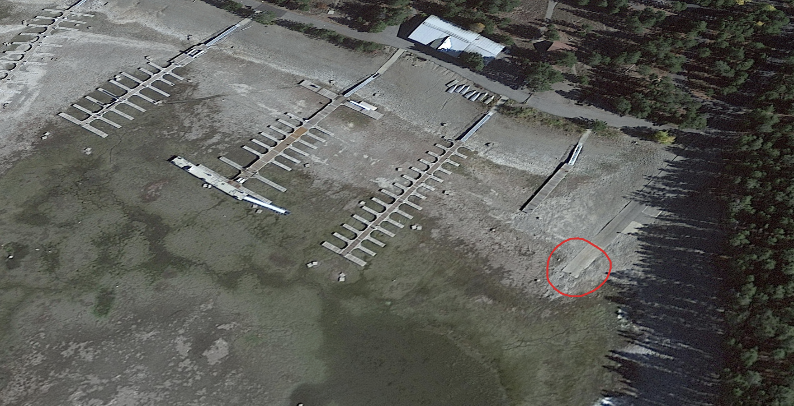
</div>

]

.panel[.panel-name[Ramp Diagram]

<div style="text-align: center;">
  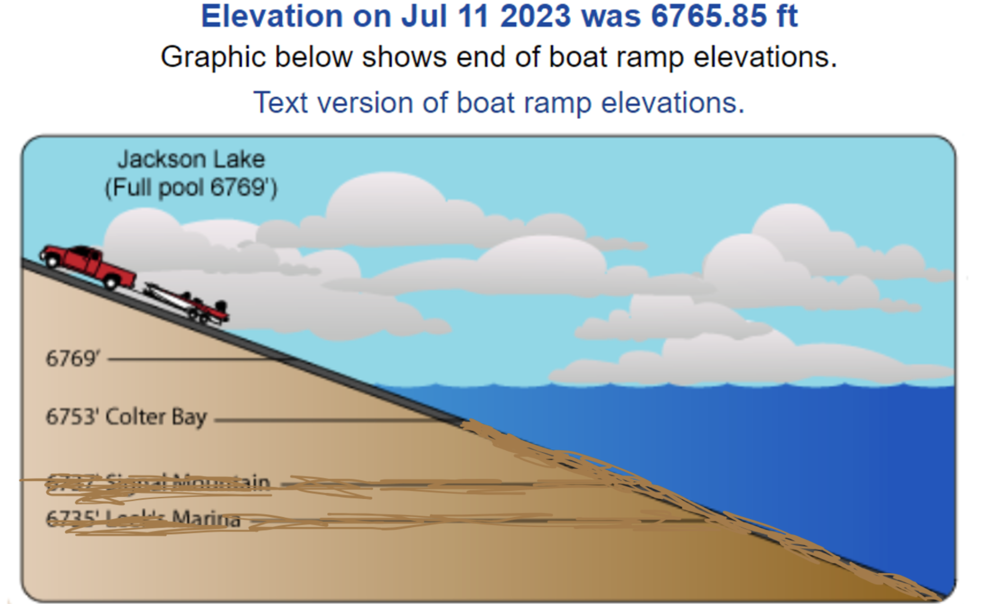
</div>

]


.panel[.panel-name[Level]
<div id="htmlwidget_container" class="plotly html-widget" style="position: relative; width: 700px; height: 500px;">
```{r plotly_level_1}
ts_plotly(list(level_ts_d), ylab = "level (ft)", title = "Jackson Lake level (Daily)", colors = c("#6FB1D1"), plot_height = 415, plot_width = 800) %>%
  add_lines(x = ~Date, y = rep(6753, nrow(as_tsibble(level_ts_d))), line = list(color = 'goldenrod')) 
```
</div>
]
]

---
<div class="logo"></div>

# Daily Lag

<div style="text-align: center;">
  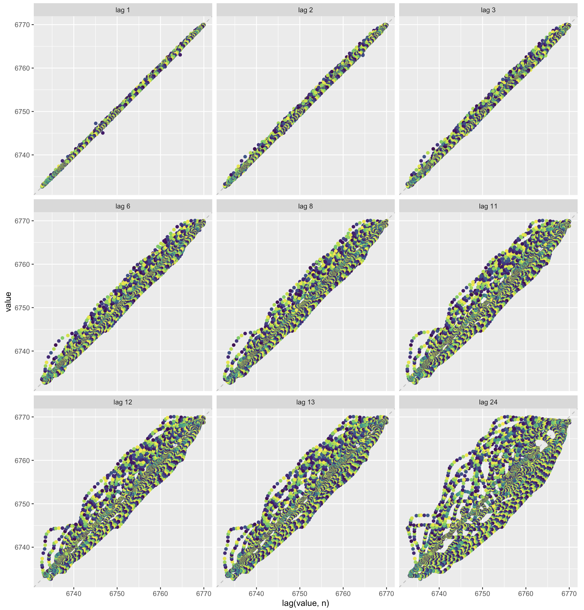
</div>


---
<div class="logo"></div>

# Monthly Lag

<div style="text-align: center;">
  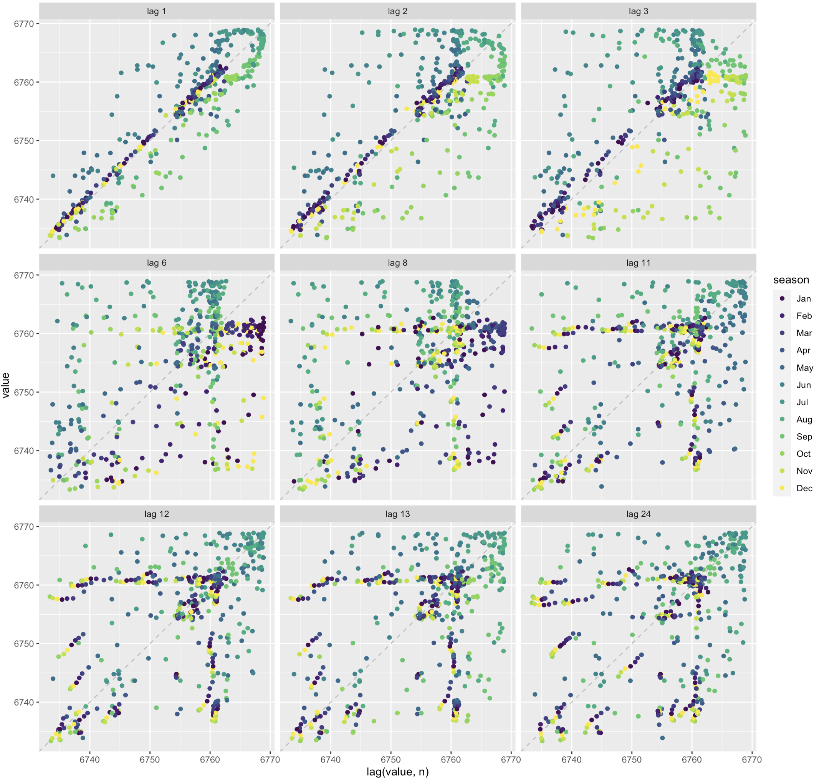
</div>

---
<div class="logo"></div>

# Yearly Lag

<div style="text-align: center;">
  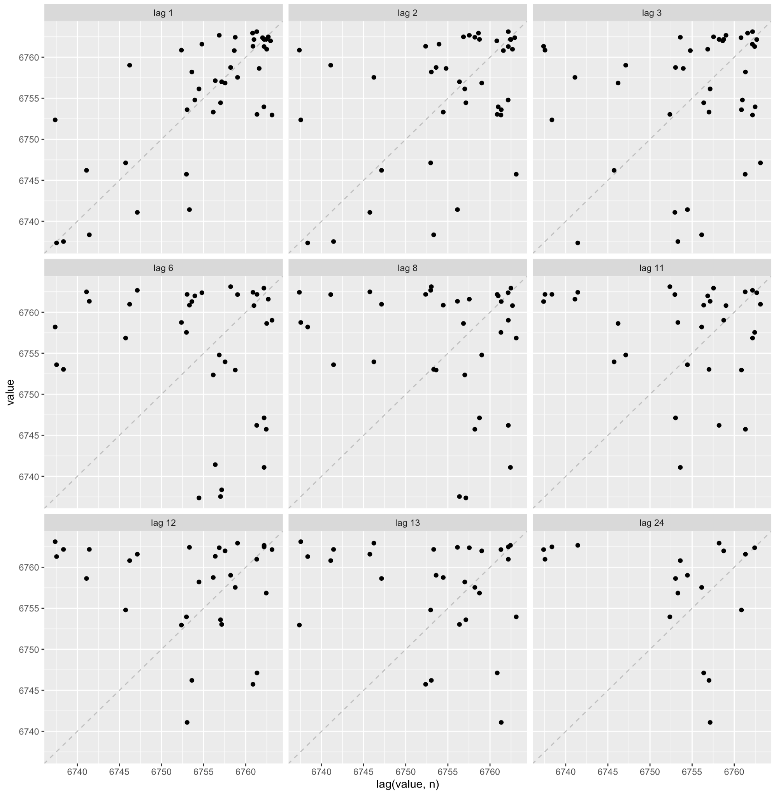
</div>

---
<div class="logo"></div>

# Objectives 

- Are we trying to nail prediction on a fine resolution?

--

    - Are we trying to be able to alert boaters months in advance if we think its going to be a good boating season. 
    
--

- Or, ...

--

- Are we trying to capture the long term viability of the ramp, monthly point estimates are not so important. Trending up or Down? 

--

- Or both!

---
<div class="logo"></div>

# Short Term 

<div id="htmlwidget_container" class="plotly html-widget" style="position: relative; width: 700px; height: 500px;">
```{r}
load(paste0(R_data, "lv_fcast_ARIMA_m.Rdata"))
plotlyF_plot(
  lv_split_m$train,
  lv_split_m$test,
  lv_fcast_ARIMA_m,
  1979,
  paste0(lv_fcast_ARIMA_m$method, ", ", Frq2W(lv_fcast_ARIMA_m$method), " Level Forecast"),
  "",
  "Level, ft",
  plot_height = 525,
  plot_width = 950,
  f2l = FALSE
)
```
</div>

---


# Short Term with Moran Predictor

<div id="htmlwidget_container" class="plotly html-widget" style="position: relative; width: 700px; height: 500px;">
```{r}
load("/Users/danielhintz/Dropbox/UNI/WEST_int/data/ARIMA_lv_Moran.Rdata")
plotlyF_plot(
  trian_87_m,
  test_87_m,
  lv_fcast_ARIMA_m3,
  1979,
  "Regression with ARIMA(1,0,2)(2,0,0)[12], 8 Year backcast",
  "",
  "Level, ft",
  plot_height = 525,
  plot_width = 950,
  f2l = FALSE
)
```
</div>


---
<div class="logo"></div>

# Short Term with Moran Predictor

```{r,message=FALSE, warning=FALSE}
tsibble::as_tsibble(lv_fcast_ARIMA_m3$mean) %>%
  GG_subseries(value, period = 12) +
  geom_hline(
    yintercept = 6753,
    color = "#FACC3F",
    linetype = "dashed",
    size = 1.2
  )
```


---
<div class="logo"></div>

# Long term 


.panelset[
.panel[.panel-name[Sub-Series]

<div style="text-align: center;">
  
</div>

]

.panel[.panel-name[ARIMA]

<div style="text-align: center;">
  
</div>

]


.panel[.panel-name[SNAIVE]

<div style="text-align: center;">
  
</div>

]

.panel[.panel-name[SNAIVE Sub-Series]

<div style="text-align: center;">
  
</div>


]

.panel[.panel-name[ARIMA Sub-Series]

<div style="text-align: center;">
  
</div>

]
]

<!-- text immediately below ??? is present note accessible from presenter mode from hitting P-->
???
- Why am I showing you forecasts that are clearly bad? 
- Because we need covariates that capture information that allows for drift and non-stationary in our forecasts
- So what might they those covariates/variables be?
- For that we might need your insights 
<!-- there is no symbol to end presenter comments-->


---
<div class="logo"></div>

# System Drivers

.panelset[
.panel[.panel-name[Predictors]

- So far, we have looked at:
    - Deficit 
    - Outflow

]

.panel[.panel-name[Deficit vs Outflow]

<div style="text-align: center;">
  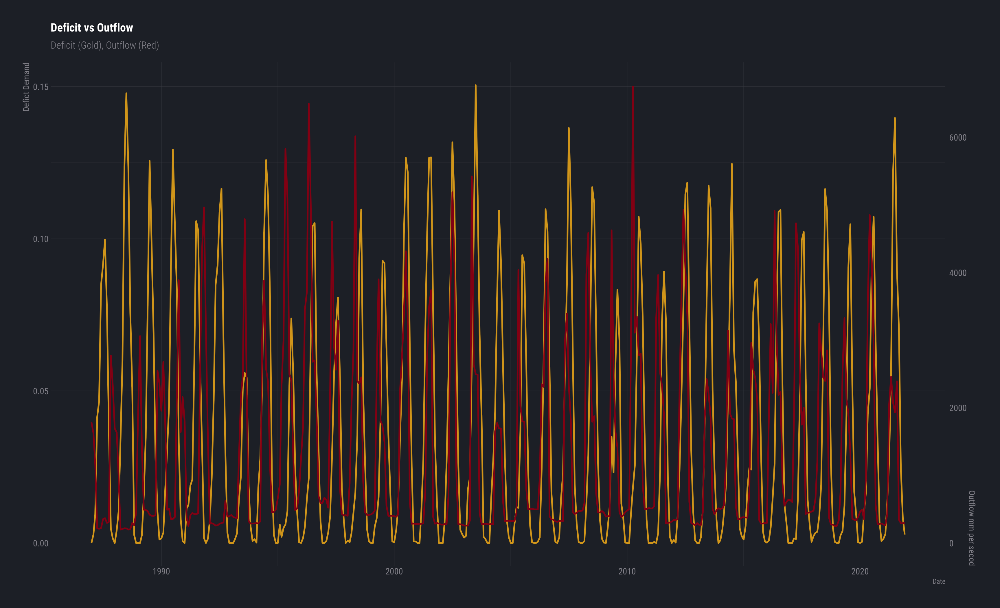
</div>

]

.panel[.panel-name[Level]

<div id="htmlwidget_container" class="plotly html-widget" style="position: relative; width: 700px; height: 500px;">
```{r plotly_level_2}
ts_plotly(list(level_ts_d), ylab = "level (ft)", title = "Jackson Lake level (Daily)",colors = c("#6FB1D1"),plot_height = 415, plot_width = 800)
```
</div>

]

.panel[.panel-name[ARIMA]

<div style="text-align: center;">
  
</div>

]
]

---
<div class="logo"></div>

# Missing Information?

.pull-left[

<div style="text-align: center;">
  <h2 style="font-size: 16px;">Wyoming Drought Index</h2>
  
</div>

]
.pull-right[

<div id="htmlwidget_container" class="plotly html-widget" style="position: relative; width: 700px; height: 500px;">
```{r plotly_level_3}
ts_plotly(list(level_ts_d), ylab = "level (ft)", title = "Jackson Lake level (Daily)",colors = c("#6FB1D1"),plot_height = 540, plot_width = 500) %>%
  add_lines(x = ~Date, y = rep(6753, nrow(as_tsibble(level_ts_d))), line = list(color = 'goldenrod')) 
```
</div>

]
 
---
class: center, middle

# Thank You

